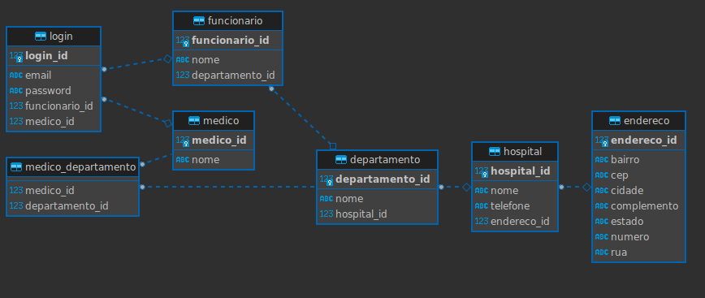

<h1 align="center">Serramed.</h1>

 This is a hospital management backend. The application follows the MVC design pattern, performance rules such as always using lazy fetchType, security standards with JWT and Spring Security, and complete documentation through Swagger.

<h2 align="center">Database</h2>

Team:
 Felipe Leopoldino -> @FelipeLeopoldino
 Pedro Montel -> @bZdhar
 Arthur Barbosa -> @ArthurBarbosa10

Tecnologies:
 Java 17
 Spring 3.1.0
 JWT
 PostgreSQL
 Swagger
 Git e GitHub

